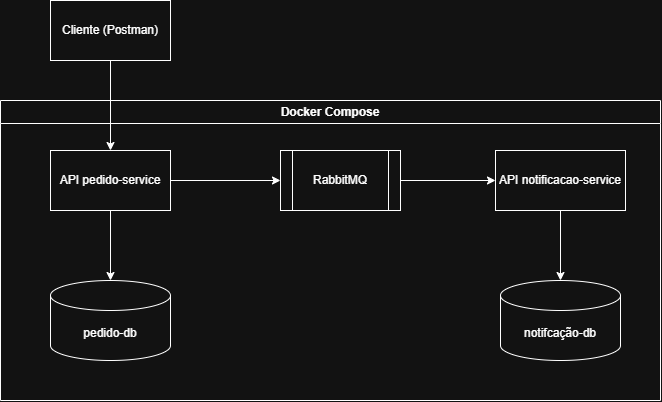

# Sistema de Pedidos e Notificação

## Sobre o projeto

Este projeto é um trabalho de Computação Distribuída que integra os serviços `pedido-service` e `notificação-service`. Cada serviço possui seu próprio banco de dados e sua própria stack. O RabbitMQ faz a comunicação entre os serviços por meio de mensagens, e todo o ambiente é executado com Docker.

### Arquitetura



## Executar com Docker Compose

### Pré-requisitos

- Docker instalado e em execução (Docker Desktop no Windows).
- Docker Compose v2, disponível pelo comando `docker compose`.

Não é necessário instalar Java, Gradle ou PostgreSQL localmente: o Compose constrói a aplicação e inicia o banco de dados em containers.

### Configuração

Na raiz do projeto, crie o arquivo `.env` a partir do exemplo:

```powershell
cp .env.example .env
```

Edite o `.env` e defina senhas para `POSTGRES_PASSWORD` e `DB_PASSWORD`. As duas devem ter o mesmo valor. `POSTGRES_USER` e `DB_USERNAME` também devem corresponder, assim como o nome do banco em `POSTGRES_DB` e no final de `DB_URL`.

Por padrão, `DB_URL` usa `pedido-db:5432`, que é o endereço interno do banco na rede do Compose. Não troque por `localhost:5433` nessa variável: a porta `5433` é para conexões feitas do computador host.

Não compartilhe nem versione o `.env`; ele contém credenciais. O `.env.example` pode ser mantido no repositório sem senhas reais.

### Iniciar

Na raiz do projeto, execute:

```powershell
docker compose up --build
```

O primeiro início pode levar alguns minutos, pois o Docker precisa baixar as imagens e construir a aplicação. Para iniciar em segundo plano:

```powershell
docker compose up --build -d
```

A API fica disponível em [http://localhost:8080](http://localhost:8080), e o PostgreSQL pode ser acessado do host pela porta `5433`. As migrações do banco são aplicadas automaticamente pela aplicação ao iniciar.

Para acompanhar os logs da API:

```powershell
docker compose logs -f pedido-service
```

Para parar os containers:

```powershell
docker compose down
```

Os dados do banco ficam no volume `pedido-db-data` e são preservados ao parar ou remover os containers. Para apagar também os dados persistidos e recriar o banco do zero, use `docker compose down -v`; essa ação é irreversível.
