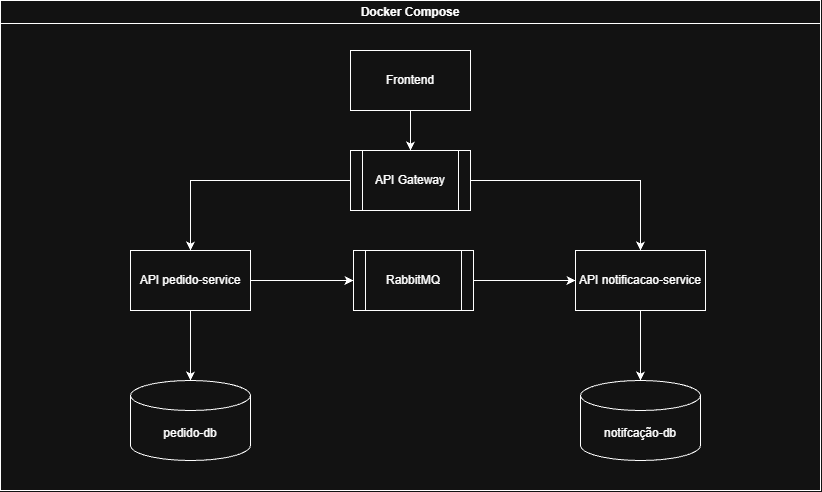

# Sistema de Pedidos e Notificação

## Sobre o projeto

Este projeto foi desenvolvido para a disciplina de **Computação Distribuída** e consiste em uma aplicação distribuída composta por um frontend, um API Gateway e dois serviços independentes: `pedido-service` e `notificacao-service`.

Toda a infraestrutura é executada localmente por meio do **Docker Compose**, que gerencia os contêineres e a comunicação entre os componentes.

### Arquitetura



- **Frontend:** interface de interação com a aplicação, responsável por encaminhar as requisições ao API Gateway.
- **API Gateway:** ponto de entrada das requisições do frontend, responsável por direcioná-las aos serviços correspondentes.
- **pedido-service:** serviço responsável pelo gerenciamento dos pedidos, com seu próprio banco de dados, `pedido-db`.
- **notificacao-service:** serviço responsável pelo processamento das notificações, com seu próprio banco de dados, `notificacao-db`.
- **RabbitMQ:** sistema de mensageria utilizado para a comunicação assíncrona entre os serviços, permitindo que o `pedido-service` envie mensagens para o `notificacao-service`.
- **Bancos de dados:** cada serviço possui seu próprio banco de dados, garantindo a separação e a autonomia dos dados.

### Comunicação entre os componentes

O frontend envia requisições ao API Gateway, que as direciona ao serviço responsável pela operação. Quando uma ação exige uma notificação, o `pedido-service` publica uma mensagem no RabbitMQ, que é consumida pelo `notificacao-service` para realizar o processamento correspondente.

Essa arquitetura demonstra conceitos fundamentais de sistemas distribuídos, como **separação de responsabilidades, comunicação assíncrona, autonomia dos serviços e isolamento de dados**.

## Executar com Docker Compose

### Pré-requisitos

- Docker instalado e em execução (Docker Desktop no Windows).
- Docker Compose v2, disponível pelo comando `docker compose`.

Não é necessário instalar Java, Gradle ou PostgreSQL localmente: o Compose constrói a aplicação e inicia o banco de dados em containers.

### Configuração

Na raiz do projeto, crie o arquivo `.env` a partir do exemplo:

```powershell
cp .env.example .env
```

Edite o `.env` e defina senhas para `POSTGRES_PASSWORD` e `DB_PASSWORD`. As duas devem ter o mesmo valor. `POSTGRES_USER` e `DB_USERNAME` também devem corresponder, assim como o nome do banco em `POSTGRES_DB` e no final de `DB_URL`. Também defina senha para `RABBITMQ_PASSWORD` e um valor para `RABBITMQ_USER`. Para o serviço de notificações, defina também senhas para `NOTIFICACAO_POSTGRES_PASSWORD` e `NOTIFICACAO_DB_PASSWORD`, com o mesmo valor. `NOTIFICACAO_POSTGRES_USER` e `NOTIFICACAO_DB_USERNAME` também devem corresponder, assim como o nome do banco em `NOTIFICACAO_POSTGRES_DB` e no final de `NOTIFICACAO_DB_URL`.


Por padrão, `DB_URL` usa `pedido-db:5432`, que é o endereço interno do banco na rede do Compose. Não troque por `localhost:5433` nessa variável: a porta `5433` é para conexões feitas do computador host.

Não compartilhe nem versione o `.env`; ele contém credenciais. O `.env.example` pode ser mantido no repositório sem senhas reais.

### Iniciar

Na raiz do projeto, inicie a aplicação com:

```powershell
docker compose up --build
```

O primeiro início pode levar alguns minutos, pois o Docker precisa baixar as imagens e construir os serviços. Para iniciar em segundo plano:

```powershell
docker compose up --build -d
```

Com os serviços iniciados, acesse o frontend em [http://localhost:3000](http://localhost:3000). O frontend envia as requisições ao API Gateway, disponível em [http://localhost:8080](http://localhost:8080); normalmente, não é necessário acessá-lo diretamente.

Endereços disponíveis no computador host:

| Serviço | Endereço |
|---|---|
| Frontend | [http://localhost:3000](http://localhost:3000) |
| API Gateway | [http://localhost:8080](http://localhost:8080) |
| pedido-service (Swagger) | [http://localhost:8081/swagger-ui/index.html](http://localhost:8081/swagger-ui/index.html) |
| notificacao-service | [http://localhost:8082/notificacoes](http://localhost:8082/notificacoes) |
| Painel do RabbitMQ | [http://localhost:15672](http://localhost:15672) (usuário e senha `RABBITMQ_*` do `.env`) |
| Banco do pedido-service | `localhost:5433` |
| Banco do notificacao-service | `localhost:5434` |


Para acompanhar os logs do API Gateway:

```powershell
docker compose logs -f api-gateway
```

Para parar os containers:

```powershell
docker compose down
```

Os dados dos bancos ficam nos volumes `pedido-db-data` e `notificacao-db-data`, e as mensagens do RabbitMQ no volume `rabbitmq-data`. Eles são preservados ao parar ou remover os containers. Para apagar também os dados persistidos e recriar os bancos do zero, use `docker compose down -v`; essa ação é irreversível.
